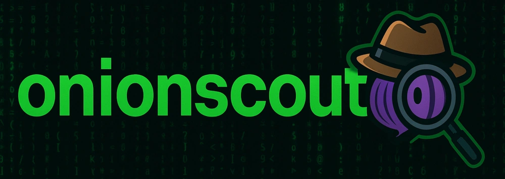

# onionscout



**onionscout** is a lightweight CLI for basic security-checks of Tor hidden services (.onion).

It will perform checks such as:
- HTTP server fingerprint (via headers & error pages)  
- Favicon retrieval & MurmurHash3  
- SSH host key fingerprint  
- HTML comments extraction  
- Status endpoints (`/server-status`, `/status`, `/webdav`…)  
- Sensitive files & paths (`info.php`, `.git`, `/admin`, etc.)  
- External resources loaded from clearnet  
- CORS headers  
- Meta-refresh redirects  
- `robots.txt` & `sitemap.xml` entries  
- HTML form `action` targets  
- WebSocket endpoints  
- Proxy-related headers (`X-Forwarded-For`, etc.)  
- `security.txt`  
- External CAPTCHA resources (including EndGame’s `cap.lua` & `queue.html`)

---

## Requirements

- Python 3.8+  
- Tor listening on `127.0.0.1:9050` if you want to use the `-tor` flag  (if you do not run it behind the Whonix Gateway).
- **pipx** (recommended)

---

## Installation via pipx

1. **Install pipx** (if you haven’t already):  
   ```bash
   python3 -m pip install --user pipx
   pipx ensurepath
   ```

2. **Install onionscout**
   ```bash
   pipx install git+https://github.com/h0ek/onionscout.git
   ```
## Usage
- Show help
  ```bash
  onionscout -h

- Run a scan at Whonix Workstation
  ```bash
  onionscout -u <ONION_URL>
  ```

- Run via Tor proxy
  ```bash
  onionscout -u -tor <ONION_URL>
  ```
## Uninstall
```bash
pipx uninstall onionscout
```

## Update
```bash
pipx upgrade onionscout
```
